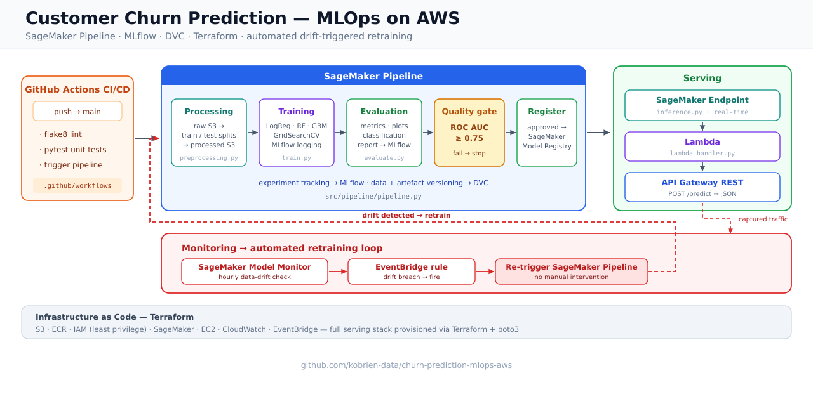

# Churn Prediction MLOps on AWS

An end-to-end MLOps pipeline for customer churn prediction, featuring automated data validation, preprocessing, multi-model training with hyperparameter tuning, experiment tracking via MLflow, SageMaker Pipelines orchestration, containerised inference via Lambda + API Gateway, and AWS infrastructure managed with Terraform.

## Table of Contents

- [Overview](#overview)
- [Architecture](#architecture)
- [Project Structure](#project-structure)
- [AWS Infrastructure](#aws-infrastructure)
- [Setup](#setup)
- [Usage](#usage)
- [ML Pipeline](#ml-pipeline)
- [Inference & Deployment](#inference--deployment)
- [Model Monitoring](#model-monitoring)
- [MLflow Tracking](#mlflow-tracking)
- [CI/CD](#cicd)
- [Data Version Control](#data-version-control)

---

## Overview

This project builds a production-ready MLOps pipeline to predict customer churn using a banking dataset. It covers the full ML lifecycle:

- **Data validation** — schema, null, and range checks
- **Preprocessing** — encoding, scaling, and SMOTE oversampling
- **Training** — Logistic Regression, Random Forest, and Gradient Boosting with GridSearchCV
- **Evaluation** — metrics, plots, and threshold analysis logged to MLflow
- **Experiment tracking** — MLflow hosted on EC2 with S3 artifact storage
- **Pipeline orchestration** — SageMaker Pipelines with conditional model registration
- **Inference** — SageMaker endpoint + Lambda function + API Gateway REST API
- **Monitoring** — SageMaker Model Monitor for data drift and quality
- **Infrastructure as code** — Terraform provisions all AWS resources

**Dataset**: [Bank Customer Churn](https://www.kaggle.com/datasets/radheshyamkollipara/bank-customer-churn) — 10,000 customer records with 18 features, target variable `Exited` (1 = churned).

---

## Architecture



**MLflow Tracking Server**: EC2 t3.micro (eu-north-1), SQLite backend, S3 artifact store

---

## Project Structure

```
churn-prediction-mlops-aws/
├── .github/workflows/
│   └── customer-churn-action.yml   # CI/CD: lint → test → SageMaker pipeline
├── data/
│   ├── raw/                        # Raw CSV (DVC-tracked)
│   └── processed/                  # Train/test splits (generated)
├── notebooks/
│   └── 01_eda.ipynb                # Exploratory data analysis
├── src/
│   ├── data/
│   │   ├── preprocessing.py        # Encoding, scaling, SMOTE, train/test split
│   │   └── data_validation.py      # Schema, null, and range validation
│   ├── training/
│   │   ├── train.py                # Multi-model training + MLflow logging
│   │   └── launch_training_job.py  # Launch SageMaker training job via boto3
│   ├── evaluation/
│   │   └── evaluate.py             # Metrics, plots, threshold analysis, MLflow logging
│   ├── inference/
│   │   ├── inference.py            # SageMaker model_fn / input_fn / predict_fn / output_fn
│   │   ├── serve.py                # Flask app served via gunicorn (port 8080)
│   │   └── lambda_handler.py       # AWS Lambda handler → invokes SageMaker endpoint
│   ├── deployment/
│   │   └── deploy.py               # Deploy approved model from registry to endpoint
│   ├── monitoring/
│   │   ├── monitor.py              # SageMaker Model Monitor baseline + hourly schedule
│   │   └── simulate-drift.py       # Send out-of-distribution data to test drift detection
│   └── pipeline/
│       └── pipeline.py             # SageMaker Pipelines definition (process → train → eval → register)
├── terraform/
│   ├── main.tf                     # Provider config & S3 remote backend
│   ├── variables.tf                # Region, IP, endpoint name
│   ├── terraform.tfvars            # Variable values (gitignored)
│   ├── aws-ec2.tf                  # MLflow tracking server (EC2 t3.micro)
│   ├── aws-s3.tf                   # Raw, processed, artifacts, monitoring buckets
│   ├── aws-iam.tf                  # SageMaker & EC2 IAM roles (least-privilege)
│   ├── aws-sagemaker.tf            # SageMaker Studio domain
│   ├── aws-ecr.tf                  # ECR repos: training, inference, lambda
│   ├── lambda.tf                   # Lambda function (Python 3.12, 30s timeout)
│   ├── api-gateway-rest.tf         # REST API: POST /predict → Lambda
│   └── aws-monitoring.tf           # SageMaker Model Monitor configuration
├── tests/
│   ├── test_mlflow_logging.py      # MLflow connectivity smoke test
│   └── smoke_test.py               # API endpoint integration tests
├── Dockerfile                      # Training image (entrypoint: train.py)
├── Dockerfile.inference            # Inference image (gunicorn on port 8080)
├── Dockerfile.lambda               # Lambda container image
├── requirements.txt
└── setup.cfg                       # Flake8: max-line-length 120
```

---

## AWS Infrastructure

All infrastructure is defined in [terraform/](terraform/) and deployed to `eu-north-1`.

| Resource | File | Purpose |
|---|---|---|
| EC2 t3.micro | `aws-ec2.tf` | MLflow tracking server (port 5000), EIP for stable address |
| S3 — raw data | `aws-s3.tf` | Raw CSV input, versioning enabled |
| S3 — processed data | `aws-s3.tf` | Preprocessed train/test splits |
| S3 — model artifacts | `aws-s3.tf` | MLflow artifacts, SageMaker model artifacts, data capture |
| S3 — monitoring | `aws-s3.tf` | Model Monitor baseline and drift reports |
| S3 — terraform state | `main.tf` | Remote Terraform state backend |
| SageMaker Domain | `aws-sagemaker.tf` | Studio workspace (IAM auth) |
| IAM Roles | `aws-iam.tf` | Scoped SageMaker execution role + EC2 instance role |
| ECR — training | `aws-ecr.tf` | Training job Docker images |
| ECR — inference | `aws-ecr.tf` | SageMaker endpoint Docker images |
| ECR — lambda | `aws-ecr.tf` | Lambda container images |
| Lambda | `lambda.tf` | `customer-churn-predict` function, Python 3.12, 30s timeout |
| API Gateway | `api-gateway-rest.tf` | REST API: `POST /predict`, throttling 50 rps / 100 burst |
| Model Monitor | `aws-monitoring.tf` | Hourly drift and quality monitoring schedule |

### Deploying Infrastructure

The Terraform backend uses S3 for remote state. Create the state bucket before running `terraform init` (it must exist first and is not managed by Terraform itself):

```bash
# Replace <YOUR_ACCOUNT_ID> with your 12-digit AWS account ID
aws s3api create-bucket \
  --bucket customer-churn-terraform-state-<YOUR_ACCOUNT_ID> \
  --region eu-north-1 \
  --create-bucket-configuration LocationConstraint=eu-north-1

aws s3api put-bucket-versioning \
  --bucket customer-churn-terraform-state-<YOUR_ACCOUNT_ID> \
  --versioning-configuration Status=Enabled

aws s3api put-bucket-encryption \
  --bucket customer-churn-terraform-state-<YOUR_ACCOUNT_ID> \
  --server-side-encryption-configuration '{"Rules":[{"ApplyServerSideEncryptionByDefault":{"SSEAlgorithm":"AES256"}}]}'
```

The backend is configured via `terraform/backend.hcl` (so the bucket name stays out of `main.tf`). Update it with your account ID before initialising:

```
# terraform/backend.hcl
bucket = "customer-churn-terraform-state-<YOUR_ACCOUNT_ID>"
key    = "churn-project/terraform.tfstate"
region = "eu-north-1"
```

Create `terraform/terraform.tfvars` with your values:

```hcl
aws_region    = "eu-north-1"
local_ip_addr = "<YOUR_PUBLIC_IP>"  # restricts SSH and MLflow port 5000 to your machine
```

Then initialise and apply:

```bash
cd terraform

terraform init -backend-config=backend.hcl
terraform plan
terraform apply
```

Once applied, get the MLflow tracking server IP:

```bash
terraform output mlflow_public_ip
```

MLflow starts automatically on the EC2 instance. The UI is available at `http://<mlflow_public_ip>:5000` within a minute or two of the instance booting.

---

## Setup

### Prerequisites

- Python 3.10+
- AWS CLI configured (`aws configure`)
- Terraform >= 1.0
- DVC (`pip install dvc[s3]`)
- Docker (for building and pushing images to ECR)

### Install Python dependencies

```bash
pip install -r requirements.txt
```

### Pull raw data with DVC

The DVC remote must point to your S3 raw data bucket. Configure it once after cloning:

```bash
dvc remote add -d s3remote s3://customer-churn-raw-data-<YOUR_ACCOUNT_ID>
dvc pull
```

### Build and push Docker images to ECR

All three images must be in ECR before running the pipeline or deploying the endpoint. Authenticate Docker to ECR once per session:

```bash
aws ecr get-login-password --region eu-north-1 | \
  docker login --username AWS --password-stdin <YOUR_ACCOUNT_ID>.dkr.ecr.eu-north-1.amazonaws.com
```

> **Apple Silicon (M-series) note**: Docker Desktop on Apple Silicon can push OCI-format manifests by default, which SageMaker does not support. If you hit an `Unsupported manifest media type` error, disable **Use containerd for pulling and storing images** in Docker Desktop → Settings → General, then restart Docker Desktop and rebuild.

**Training image**
```bash
docker build --platform linux/amd64 --no-cache \
  -t <YOUR_ACCOUNT_ID>.dkr.ecr.eu-north-1.amazonaws.com/customer-churn-training:latest .

docker push <YOUR_ACCOUNT_ID>.dkr.ecr.eu-north-1.amazonaws.com/customer-churn-training:latest
```

**Inference image**
```bash
docker build --platform linux/amd64 --no-cache \
  -f Dockerfile.inference \
  -t <YOUR_ACCOUNT_ID>.dkr.ecr.eu-north-1.amazonaws.com/customer-churn-inference:latest .

docker push <YOUR_ACCOUNT_ID>.dkr.ecr.eu-north-1.amazonaws.com/customer-churn-inference:latest
```

**Lambda image**
```bash
docker build --platform linux/amd64 --no-cache \
  -f Dockerfile.lambda \
  -t <YOUR_ACCOUNT_ID>.dkr.ecr.eu-north-1.amazonaws.com/customer-churn-lambda:latest .

docker push <YOUR_ACCOUNT_ID>.dkr.ecr.eu-north-1.amazonaws.com/customer-churn-lambda:latest
```
---

## Usage

### 1. Validate raw data

```bash
python -c "from src.data.data_validation import validate_churn_csv; validate_churn_csv('data/raw/Customer-Churn-Records.csv')"
```

Runs schema, null, and value range checks and prints a pass/fail report.

### 2. Preprocess data

```bash
python src/data/preprocessing.py \
  --input-path data/raw/Customer-Churn-Records.csv \
  --output-path data/processed/
```

Outputs `X_train.csv`, `X_test.csv`, `y_train.csv`, `y_test.csv` to `data/processed/`.

### 3. Train models locally

```bash
export MLFLOW_TRACKING_URI=http://<EC2_PUBLIC_IP>:5000
python src/training/train.py \
  --train data/processed/train \
  --test data/processed/test \
  --model-dir models/
```

Trains all three models with GridSearchCV, selects the best by ROC AUC, logs to MLflow, and saves `model.joblib`.

### 4. Run the full SageMaker Pipeline

```bash
export SAGEMAKER_ROLE_ARN=arn:aws:iam::<account>:role/...
export TRAINING_IMAGE_URI=<account>.dkr.ecr.eu-north-1.amazonaws.com/customer-churn-training:latest
export S3_RAW_DATA_BUCKET=customer-churn-raw-data-<account>
export S3_PROCESSED_DATA_BUCKET=customer-churn-processed-data-<account>
export S3_MODEL_ARTIFACTS_BUCKET=customer-churn-model-artifacts-<account>
export MLFLOW_TRACKING_URI=http://<EC2_PUBLIC_IP>:5000

python src/pipeline/pipeline.py
```

### 5. Deploy the latest approved model

Requires `SAGEMAKER_ROLE_ARN` to be set and the inference image to already be in ECR (see [Build and push Docker images](#build-and-push-docker-images-to-ecr)).

```bash
export SAGEMAKER_ROLE_ARN=arn:aws:iam::<YOUR_ACCOUNT_ID>:role/customer-churn-sagemaker-execution-role
python src/deployment/deploy.py
```

Fetches the most recently approved model from the SageMaker Model Registry and creates or updates the `customer-churn-endpoint`.

### 6. Run smoke tests

```bash
pytest tests/
```

### 7. Test endpoint

Get the API URL from Terraform:

```bash
cd terraform && terraform output api_gateway_invoke_url
```

Use the returned URL as a `POST` endpoint in Postman or curl (see [Lambda + API Gateway](#lambda--api-gateway) for the request body format).

---

## ML Pipeline

### Models & Hyperparameter Grids

| Model | Hyperparameters Searched |
|---|---|
| Logistic Regression | `C`: [0.01, 0.1, 1, 10], `penalty`: l2 |
| Random Forest | `n_estimators`: [50, 100, 200], `max_depth`: [None, 10, 20], `min_samples_split`: [2, 5, 10] |
| Gradient Boosting | `n_estimators`: [50, 100, 200], `learning_rate`: [0.01, 0.1, 0.2], `max_depth`: [3, 5, 7] |

All models use **ROC AUC** as the cross-validation scoring metric (5-fold). The best model across all three is saved as `model.joblib`.

### Preprocessing Steps

1. Drop `RowNumber`, `CustomerId`, `Surname`, `Complain`
2. One-hot encode `Geography`, `Gender`, `Card Type`
3. `StandardScaler` on `CreditScore`, `Age`, `Tenure`, `Balance`, `EstimatedSalary`, `Point Earned`
4. Stratified 80/20 train/test split (random state 42)
5. SMOTE applied to training set only to address class imbalance (~20% churn rate)

### Evaluation

The evaluation step computes and logs to MLflow:

- Accuracy, Precision, Recall, F1, ROC AUC
- Classification report and confusion matrix
- ROC curve, Precision-Recall curve
- Feature importance plot (tree-based models)
- Threshold performance analysis (0.3–0.6)

A model is only registered if ROC AUC ≥ 0.75 (enforced by the SageMaker Pipelines condition step).

---

## Inference & Deployment

Three inference options are available:

### SageMaker Endpoint

The endpoint runs a Flask app ([serve.py](src/inference/serve.py)) via gunicorn on port 8080 using the inference image. [inference.py](src/inference/inference.py) implements the SageMaker `model_fn` / `input_fn` / `predict_fn` / `output_fn` interface.

### Lambda + API Gateway

Send predictions via the public REST API:

```bash
# Get the URL from: cd terraform && terraform output api_gateway_invoke_url
curl -X POST https://<API_ID>.execute-api.eu-north-1.amazonaws.com/prod/predict \
  -H "Content-Type: application/json" \
  -d '{"CreditScore": 600, "Age": 40, ...}'
```

Response:

```json
{
  "prediction": 1,
  "churn": true,
  "churn_probability": 0.83,
  "confidence": 0.83
}
```

The Lambda function ([lambda_handler.py](src/inference/lambda_handler.py)) invokes the SageMaker endpoint via `sagemaker-runtime`.

### Building & Pushing Docker Images

See [Build and push Docker images](#build-and-push-docker-images-to-ecr) in the Setup section for full instructions including the Apple Silicon note.

---

## Model Monitoring

SageMaker Model Monitor runs on an hourly schedule to detect data drift and quality issues.

```bash
# Set up baseline and schedule
python src/monitoring/monitor.py

# Simulate drift to test detection
python src/monitoring/simulate-drift.py
```

Monitoring results are written to `s3://customer-churn-monitoring-<account>/`.

---

## MLflow Tracking

MLflow is hosted on an EC2 t3.micro instance with:

- **Backend store**: SQLite at `/mlflow/mlflow.db`
- **Artifact store**: `s3://customer-churn-model-artifacts-<account>/mlflow`

Access the UI at `http://<EC2_PUBLIC_IP>:5000` (IP-restricted to your machine).

All training and evaluation runs are logged under the experiment **"Churn Prediction Models"**.

---

## CI/CD

GitHub Actions ([.github/workflows/customer-churn-action.yml](.github/workflows/customer-churn-action.yml)) triggers on every push to `main`:

1. **Lint** — `flake8 src/`
2. **Test** — `pytest tests/`
3. **Pipeline** — `python src/pipeline/pipeline.py` (runs the full SageMaker Pipeline)

Required GitHub secrets: `SAGEMAKER_ROLE_ARN`, `TRAINING_IMAGE_URI`, `S3_RAW_DATA_BUCKET`, `S3_PROCESSED_DATA_BUCKET`, `S3_MODEL_ARTIFACTS_BUCKET`, `MLFLOW_TRACKING_URI`.

---

## Data Version Control

Raw data is tracked with DVC. The `.dvc` file records the MD5 hash of `Customer-Churn-Records.csv` to ensure reproducibility.

```bash
# After updating raw data
dvc add data/raw/Customer-Churn-Records.csv
git add data/raw/Customer-Churn-Records.csv.dvc
git commit -m "update raw data"
dvc push
```
